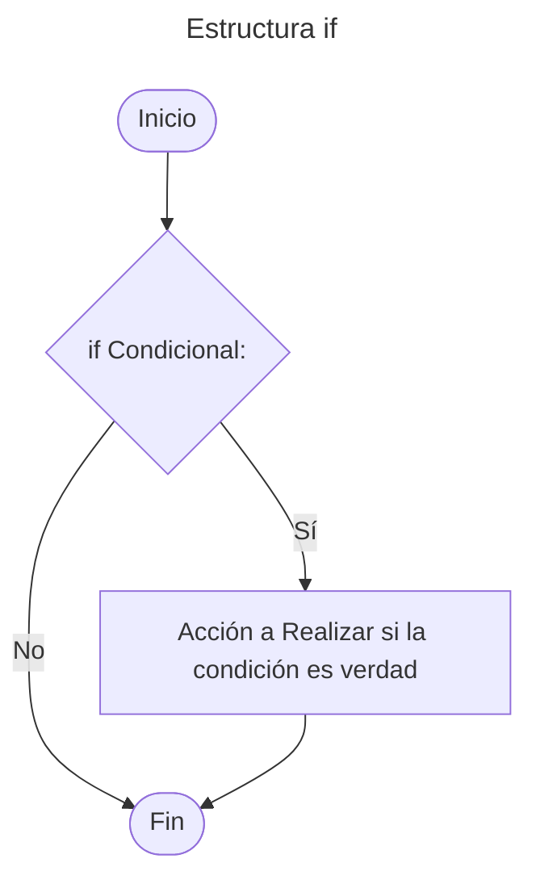
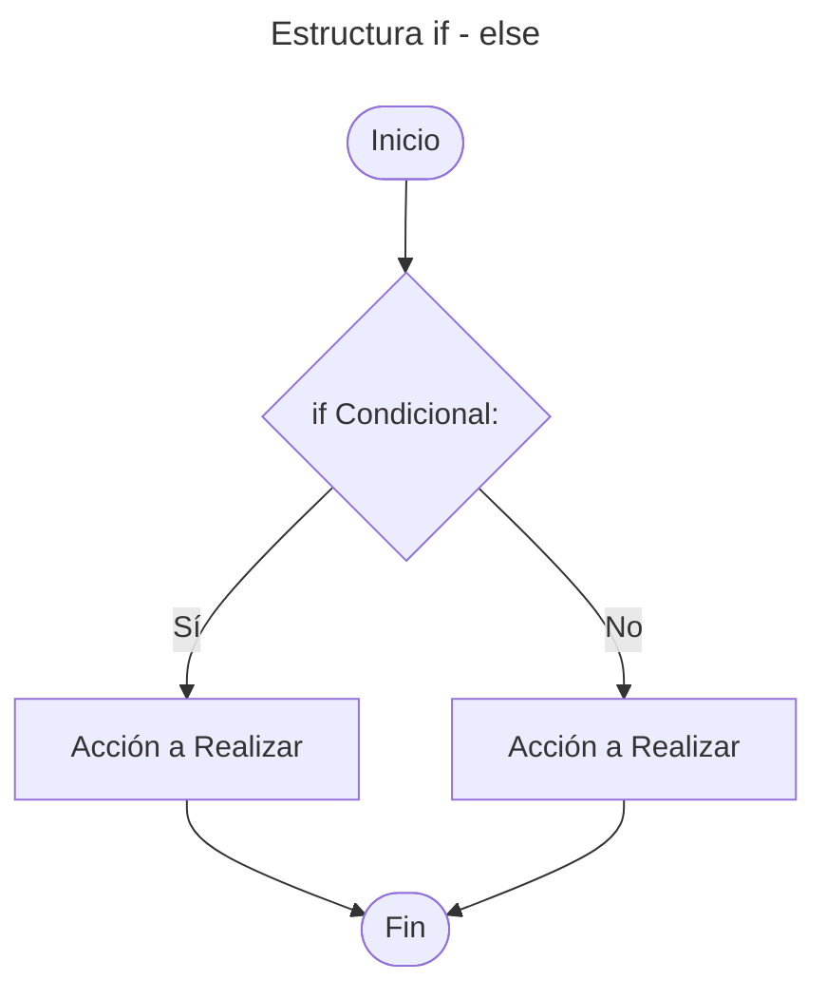
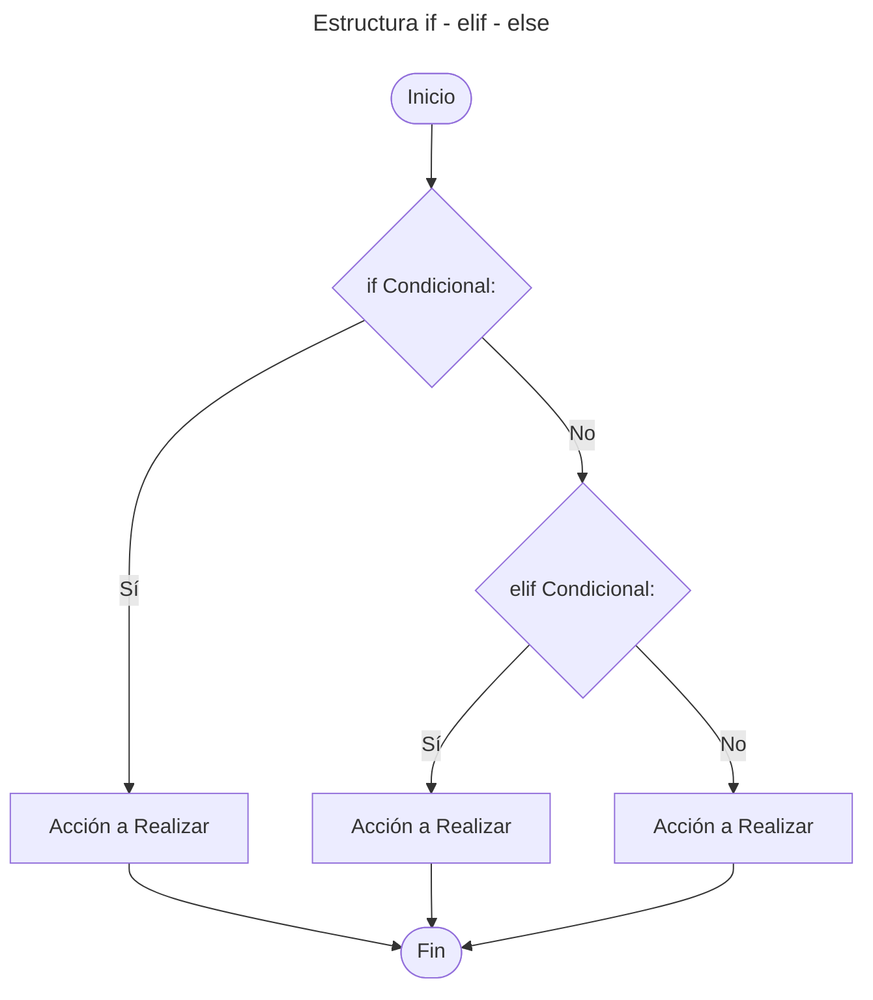
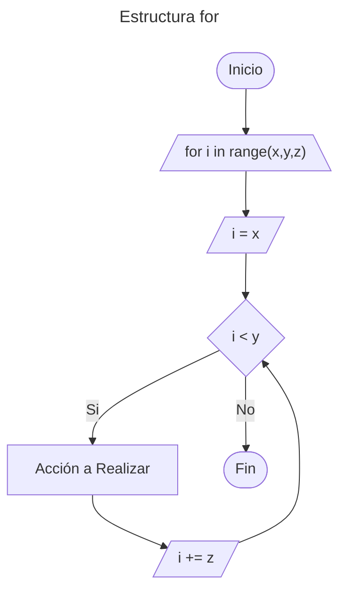
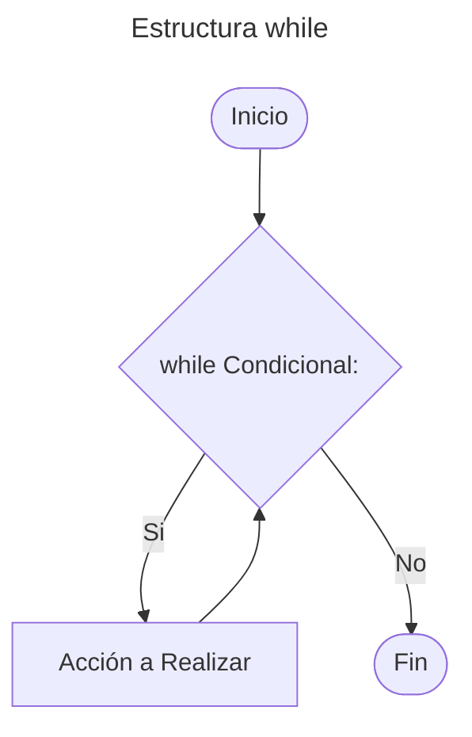

# 5. Estructuras de control

Nos permite controlar el flujo de ejecución de un programa

---

## Tabla de Contenido

- [5. Estructuras de control](#5-estructuras-de-control)
  - [Tabla de Contenido](#tabla-de-contenido)
  - [Estructuras Condicionales](#estructuras-condicionales)
    - [Estructura `if`](#estructura-if)
    - [Estructura `if-else`](#estructura-if-else)
    - [Estructura `if-elif-else`](#estructura-if-elif-else)
    - [Condicionales anidados](#condicionales-anidados)
  - [Estructura Bucle / loop](#estructura-bucle--loop)
    - [Estructura `for`](#estructura-for)
    - [Estructura `while`](#estructura-while)
    - [Control de Bucle](#control-de-bucle)
      - [Control `Break`](#control-break)
      - [Control `Continue`](#control-continue)
      - [Control `Pass`](#control-pass)
    - [Bucles anidados](#bucles-anidados)
  - [Ejemplos Prácticos](#ejemplos-prácticos)

---

## Estructuras Condicionales

Permite ejecutar diferentes bloques de código según se  cumpla o no una determinada condición.

### Estructura `if`

Su función es realizar o no una determinada acción o sentencia, basándose en el resultado de la evaluación de una expresión booleana (verdadero o falso).
***Sintaxis***

```python
if "Condicional":
    # Bloque de código a ejecutar si la condición es verdad
```

**Diagrama de flujo:**



### Estructura `if-else`

La estructura selectiva doble ``if - else`` permite toma de decisión. Si la condición es verdadera, entonces se sigue por un camino específico y se ejecuta una acción determinada. Por otra parte, si el resultado de la evaluación es falso, entonces se sigue por otro camino y se realiza otra acción. En ambos casos, luego de ejecutar las acciones correspondientes, se continúa con la secuencia normal del diagrama de flujo.
***Sintaxis***

```python
if "Condicional":
    # Bloque de código a ejecutar si la condición es verdad
else:
    # Bloque de código a ejecutar si la condición es falsa
```

**Diagrama de flujo:**



### Estructura `if-elif-else`

Permite establecer una serie de condiciones al interior del programa, que ayuda a determinar qué acciones llevar a cabo dadas ciertas circunstancias. La sentencia ``elif`` se usa cuando deseamos evaluar múltiples condiciones.
***Sintaxis***

```python
if "Condicional":
    # Bloque de código a ejecutar si la condición es verdad
elif "Condicional":
    # Bloque de código a ejecutar si if es falso y la condición es verdad
else:
    # Bloque de código a ejecutar si todas las condiciones son falsa
```

**Diagrama de flujo:**



### Condicionales anidados

Las instrucciones anidadas if-elif-else permiten tomar decisiones jerárquicas. El anidamiento puede ser infinito, lo que permite crear árboles de decisión complejos

***Sintaxis***

```python
if condition1:
    if condition2:
        # Código para cuando ambas condiciones son verdaderas
    else:
        # Código para cuando condition1 es verdadera pero condition2 es falsa
else:
    # Código para cuando condition1 es falsa

```

---

## Estructura Bucle / loop

Los bucles permiten repetir un bloque de código n veces

### Estructura `for`

Se utiliza para iterar sobre una secuencia o bloque de código.
***Sintaxis***

```python
for i  in range(x,y,z):
    #Bloque de código a ejecutar para cada valor en el rango
```

| Símbolo | Descripción |
| :---: | :---: |
| i | Variable de interacción |
| x | Determina cual es el valor de inicio, por defecto tiene un valor de 0 |
| y | Determina el valor de fin (sin incluir y) |
| z | Incremento o valor de paso, por defecto tiene un valor de +1 (Opcional) |

> [!NOTE]
>
> 1. Cuando *x = 0*, podemos simplificar *range (0, y)* como *range(y)*.
> 2. También es posible usar un valor de paso negativo. Al usar un paso negativo, el valor inicial debe ser mayor que el final. El valor final sigue siendo excluido.

**Diagrama de flujo:**



### Estructura `while`

Se utiliza para repetir un bloque de código mientras una condición sea verdadera.
> [!WARNING]
> Dentro del ciclo **siempre debe existir** un enunciado que afecte la condición, de tal forma que aquél no se repita de manera infinita.
***Sintaxis***

```python
while "Condicional":
    #Bloque de código a ejecutar mientras la condición sea verdadera
```

**Diagrama de flujo:**



### Control de Bucle

Existen algunas instrucciones especiales para controlar el flujo de ejecución dentro de los bucles.

#### Control `Break`

Se utiliza para salir prematuramente de un bucle, independientemente de la condición. Cuando se encuentra un *break*, el bucle se detiene y el flujo de ejecución continúa con la siguiente instrucción fuera del bucle.
**Ejemplo**

```python
contador = 0
while True:
    print(contador)
    contador += 1
    if contador == 5:
        break
```

El bucle *while* se ejecuta indefinidamente debido a la condición *True*. Se utiliza una estructura condicional para verificar si **contador es igual a 5**. Cuando se cumple esta condición, el bucle se detiene y el flujo de ejecución continúe fuera del bucle.

#### Control `Continue`

La instrucción *continue* se utiliza para saltar el resto del bloque de código dentro de un bucle y pasar a la siguiente iteración.
**Ejemplo**

```python
for i in range(10):
    if i % 2 == 0:
        continue
    print(i)
```

El bucle *for* itera sobre los números del 0 al 9. Dentro del bucle, se verifica si el número es divisible por 2. **Si el número es par**, se ejecuta la instrucción *continue*, lo que hace que se salte el resto del bloque de código y se pase a la siguiente iteración del bucle. **Como resultado, solo se imprimirán los números impares**.

#### Control `Pass`

Es una operación nula que no hace nada. Se utiliza como marcador de posición cuando se requiere una instrucción sintácticamente, pero no se desea realizar ninguna acción
**Ejemplo**

```python
for i in range(5):
    pass
```

El bucle itera sobre los números del 0 al 4, pero no se realiza ninguna acción dentro debido a la instrucción *pass*. Esto puede ser útil cuando se está desarrollando un programa y se desea reservar un bloque de código para implementarlo más adelante.

### Bucles anidados

Los bucles anidados son bucles dentro de otros bucles. El bucle interno completa todas las iteraciones por cada iteración del bucle externo, de manera similar a cómo el minutero de un reloj completa un ciclo completo por cada hora.

**Ejemplo:**

```python
for x in range(2):
    for y in range(2):
        print(x, y)

# Salida:
# 0 0
# 0 1
# 1 0
# 1 1
```

---

## Ejemplos Prácticos

- [Ejemplo Condicionales Simples `if-else`](/01-Fundamentos/05-Estructuras_de_Control/02_Condicionales_Simples.py)
- [Ejemplo Condicionales `elif`](/01-Fundamentos/05-Estructuras_de_Control/03_Condicionales_elif.py)
- [Ejemplo Condicionales Anidados](/01-Fundamentos/05-Estructuras_de_Control/04_Condicionales_anidados.py)
- [Ejemplo Estructura `for`](/01-Fundamentos/05-Estructuras_de_Control/05_Estructura_for.py)
- [Ejemplo Estructura `while`](/01-Fundamentos/05-Estructuras_de_Control/06_Estructura_while.py)
- [Ejemplo Control de Bucle](/01-Fundamentos/05-Estructuras_de_Control/07_Control_Bucle.py)
- [Ejemplo Bucles Anidados](/01-Fundamentos/05-Estructuras_de_Control/08_Bucles_anidados.py)

---

[Inicio](#5-estructuras-de-control)

---

[Tabla de contenido principal](/Tabla_Contenido.md)

---
